# Senaino

[](LICENSE)
[](docs/variants.md)
[](CHANGELOG.md)
[](LICENSE)

Senaino is an educational microcontroller board inspired by the Arduino UNO and adapted for technical training at SENAI. It was designed to help students practice soldering, electronics, bootloader recording and embedded programming with components that are easy to source in Brazil.

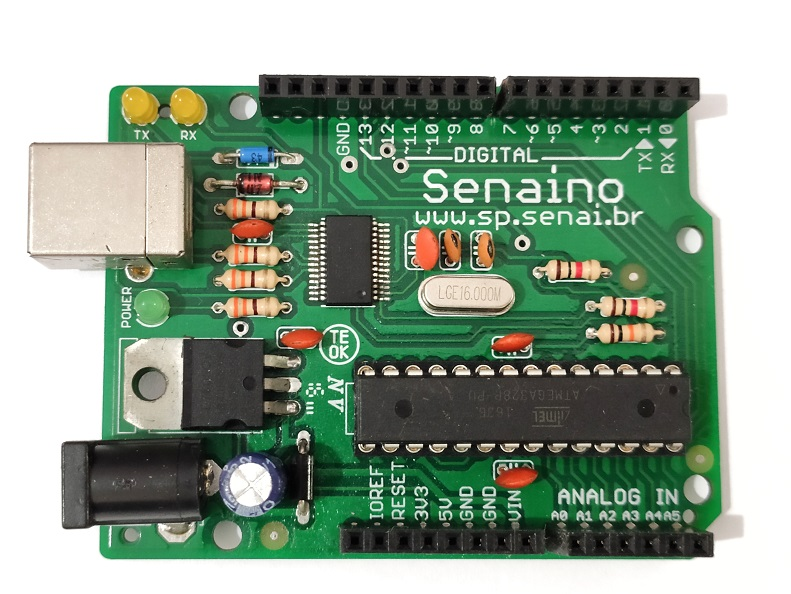

## Overview

The goal was not only to make an Arduino-compatible board, but to create a reproducible hardware kit that could be fabricated, assembled and tested by students in a classroom or lab environment.

The work included schematic design, PCB layout, component selection, production files, assembly references, documentation and validation of the mounted board.

## Highlights

- Arduino UNO-inspired board based on the ATmega328P-PU.
- Two documented USB-to-serial variants: FT232RL and CH340G.
- Through-hole component strategy for beginner-friendly soldering practice.
- 16 MHz ATmega328P clock and Arduino-style headers.
- Open hardware files for Eagle, Gerber fabrication, schematic export and BOM.
- Dedicated assembly, testing, driver and bootloader documentation.

## Repository Map

```text
assets/
  images/          Project photos and workshop/gallery images.
  reference/       Visual references for assembly.

docs/
  ft232/           FT232 assembly, BOM, production and testing notes.
  ch340/           CH340 assembly, BOM, production and testing notes.
  citation.md
  design-decisions.md
  drivers.md
  licensing.md
  variants.md

hardware/
  bom/             Spreadsheet and CSV bill of materials.
  eagle/           Eagle schematic and board files by variant.
  exports/         Schematic image/PDF exports.
  gerbers/         Fabrication files by variant.
```

## Documentation

- [Bootloader notes](docs/bootloader.md)
- [Citation and DOI guide](docs/citation.md)
- [Design decisions](docs/design-decisions.md)
- [Driver notes](docs/drivers.md)
- [License notes](docs/licensing.md)
- [Board variants](docs/variants.md)

| Variant | Assembly | BOM | Production | Testing |
|---|---|---|---|---|
| FT232 | [Guide](docs/ft232/assembly-guide.md) | [BOM](docs/ft232/bill-of-materials.md) | [Files](docs/ft232/production.md) | [Checklist](docs/ft232/testing.md) |
| CH340 | [Guide](docs/ch340/assembly-guide.md) | [BOM](docs/ch340/bill-of-materials.md) | [Files](docs/ch340/production.md) | [Checklist](docs/ch340/testing.md) |

## Hardware Files

| Variant | Eagle files | Schematic PDF | Gerbers | BOM |
|---|---|---|---|---|
| FT232 | [hardware/eagle/ft232-v1.0](hardware/eagle/ft232-v1.0) | [PDF](hardware/exports/senaino-ft232-schematic.pdf) | [Gerbers](hardware/gerbers/ft232-v1.0) | [CSV](hardware/bom/senaino-ft232-bom.csv) |
| CH340 | [hardware/eagle/ch340-v1.0](hardware/eagle/ch340-v1.0) | [PDF](hardware/exports/senaino-ch340-schematic.pdf) | [Gerbers](hardware/gerbers/ch340-v1.0) | [CSV](hardware/bom/senaino-ch340-bom.csv) |

## Board Variants

The repository documents two board variants in the `main` branch.

| Variant | USB-serial IC | Main advantage | Recommended use |
|---|---|---|---|
| FT232 | FT232RL | Traditional and widely documented | Original classroom version |
| CH340 | CH340G | Lower cost and avoids FT232 sourcing risk | Cost-sensitive or supply-risk-aware production |

The CH340 alternative exists because FT232RL sourcing can be risky. ZeptoBars documented real and fake FT232RL dies and described counterfeit/compatible chips that could behave differently with FTDI drivers: [FTDI FT232RL: real vs fake](https://zeptobars.com/en/read/FTDI-FT232RL-real-vs-fake-supereal).

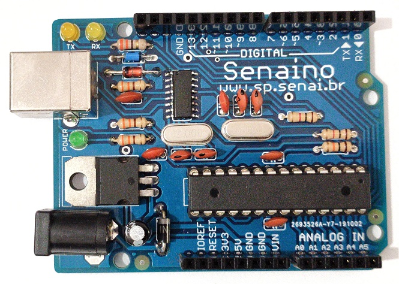

## Gallery

| | | |
|---|---|---|
| 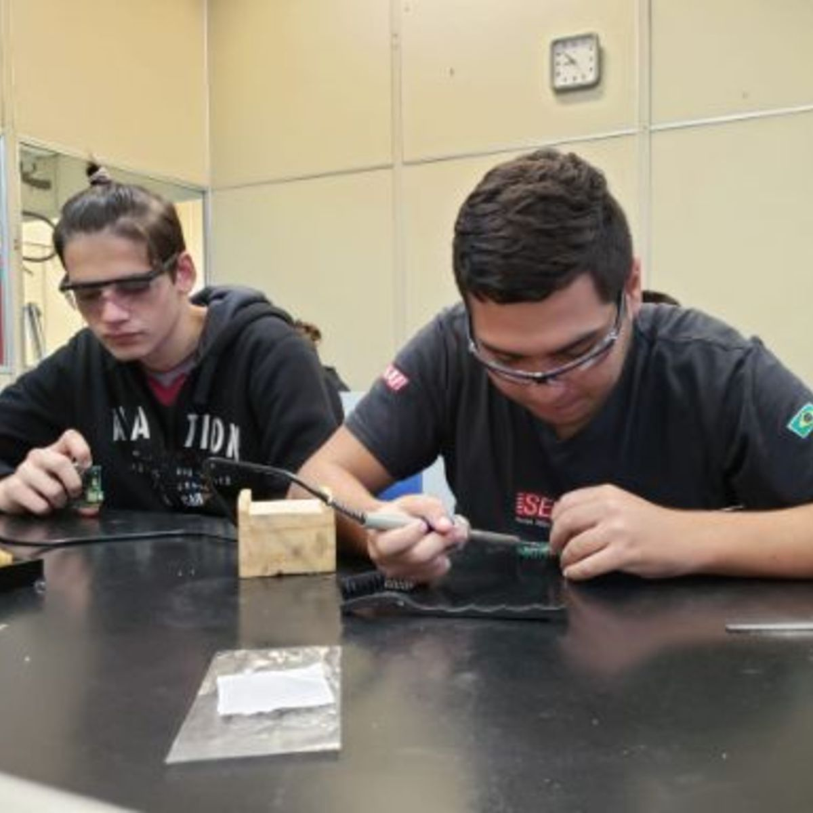 | 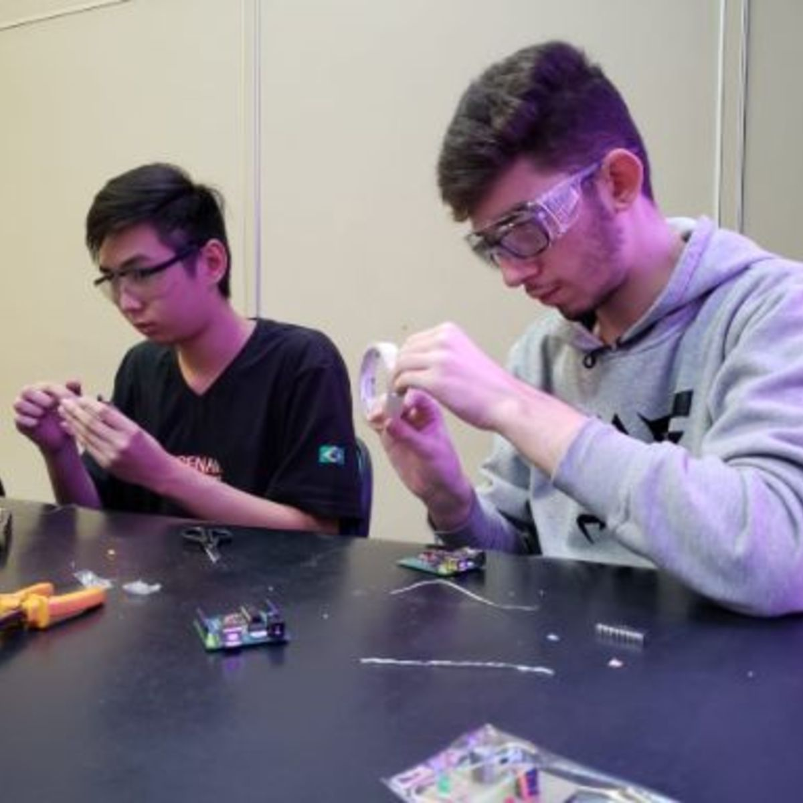 | 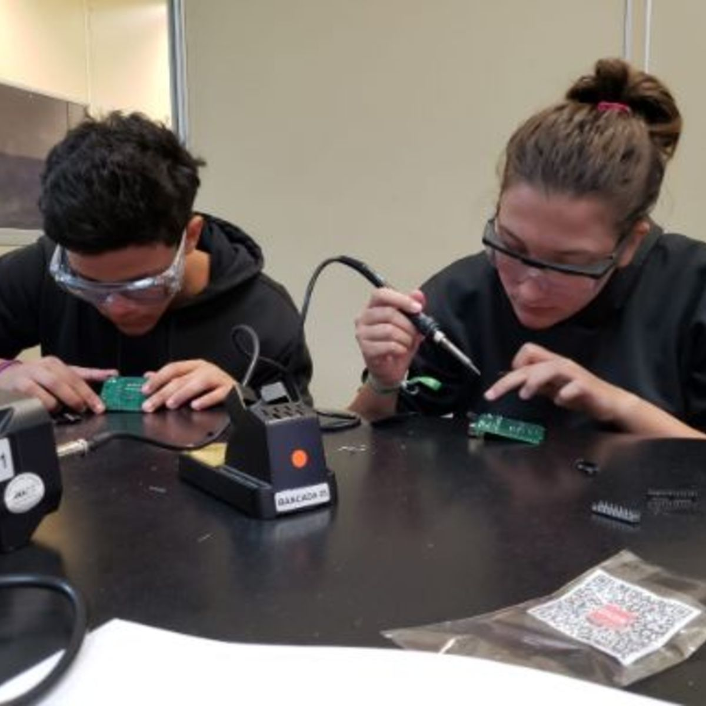 |
| 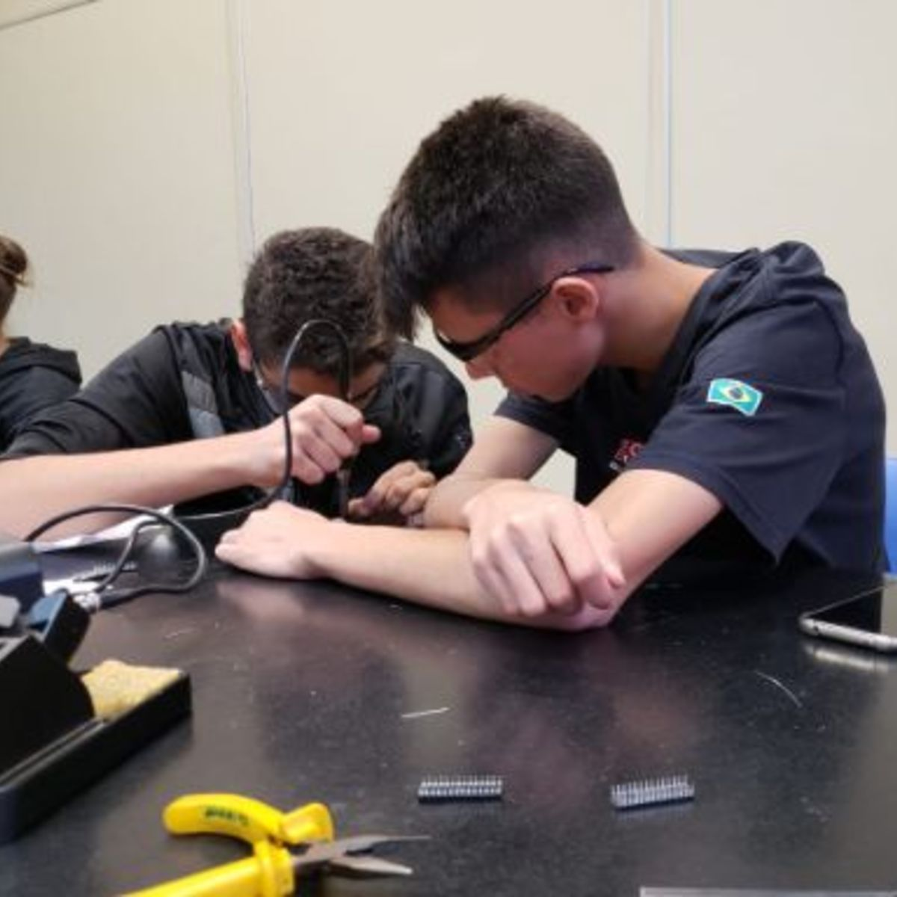 | 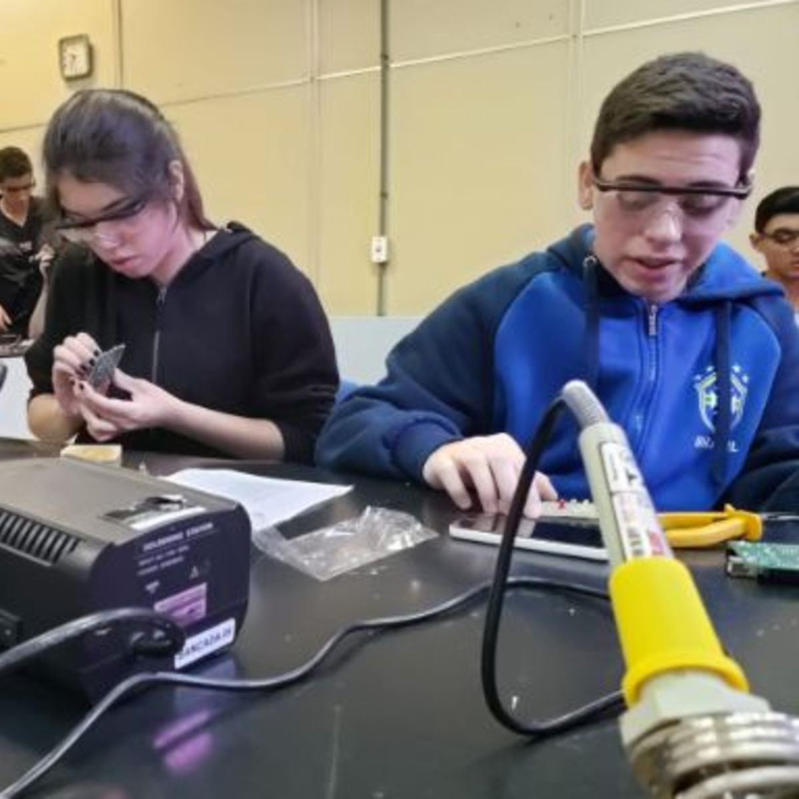 | 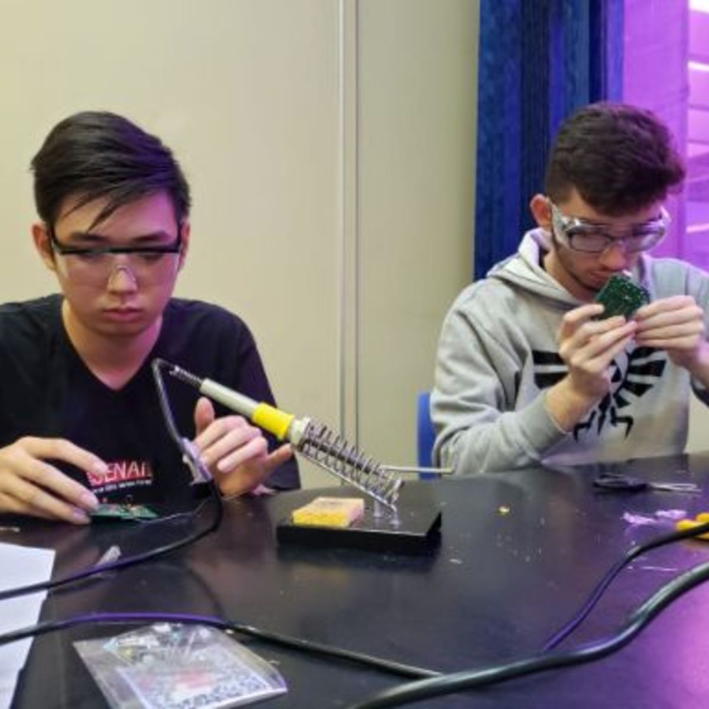 |
| 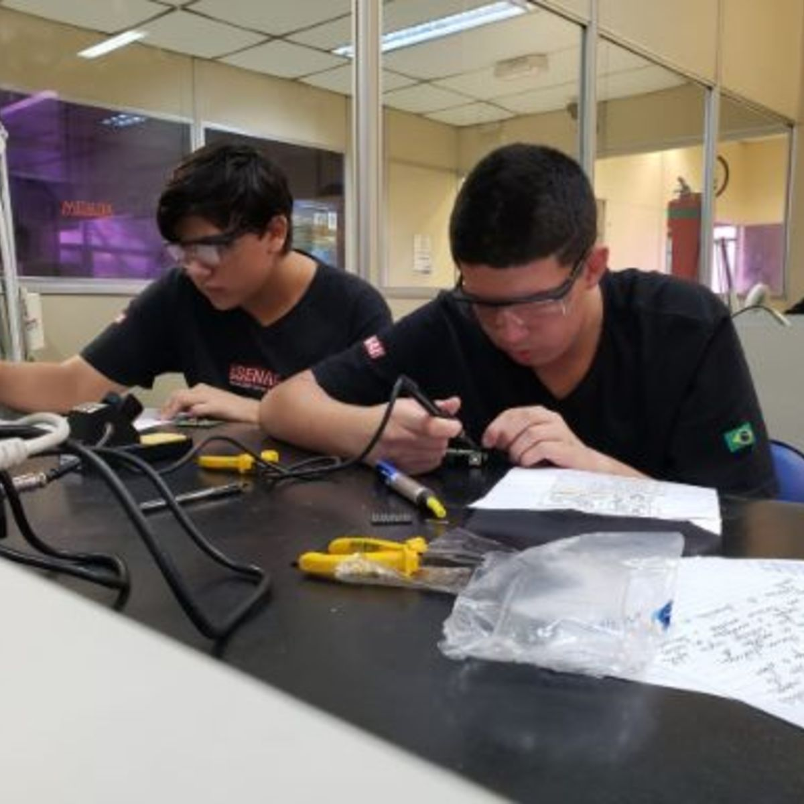 | 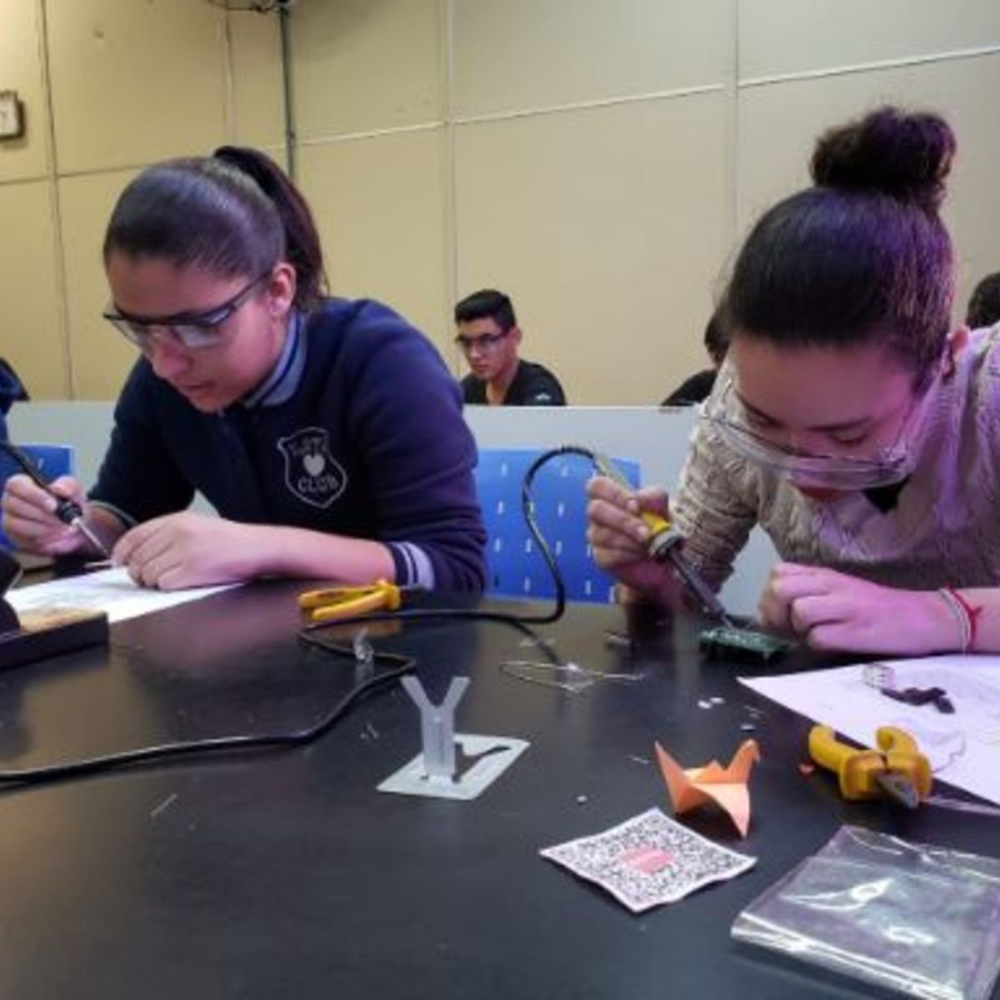 | 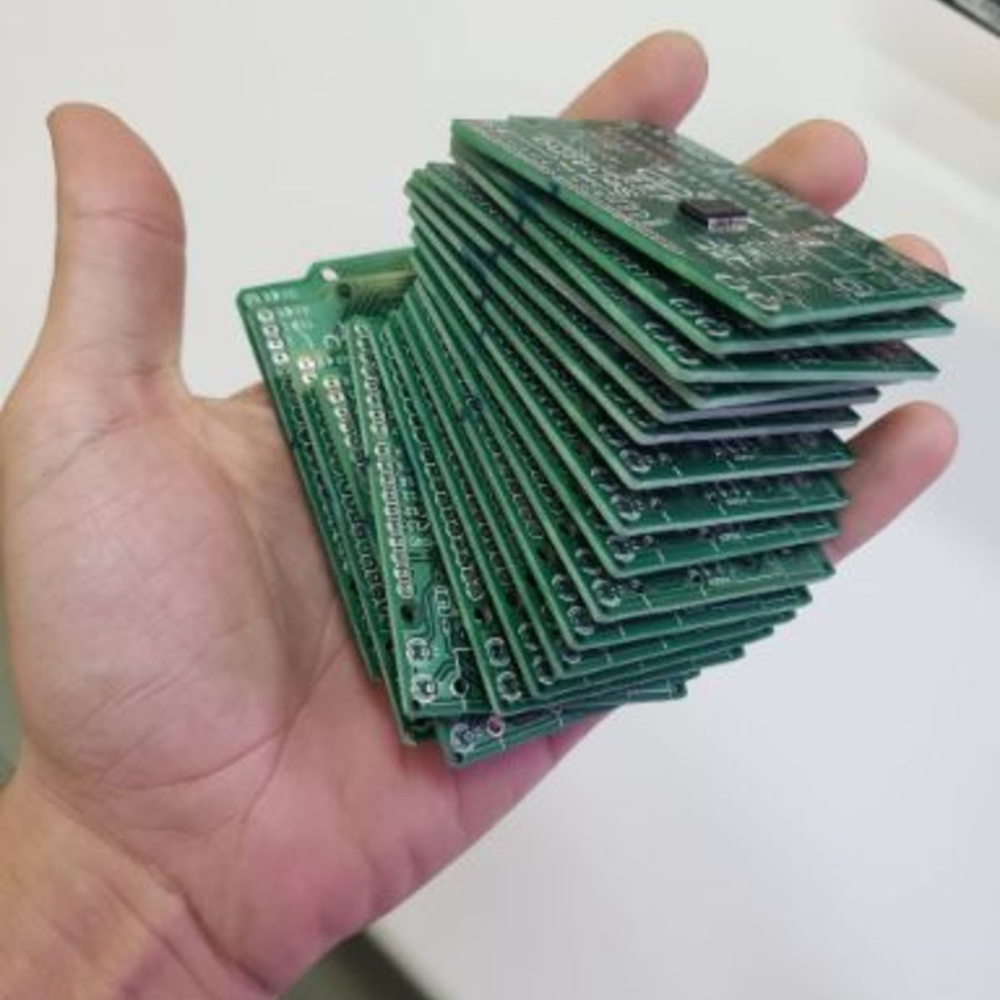 |

## Credits

Senaino was designed by Tiago Silva for educational use with [SENAI](https://www.sp.senai.br/) students. The board is inspired by the Arduino UNO reference design and keeps the educational spirit of open hardware.

## Citation

Citation metadata is available in [CITATION.cff](CITATION.cff). For DOI-based citation, archive a GitHub release from the `main` branch through Zenodo after enabling the repository in Zenodo.

## Contributing

See [CONTRIBUTING.md](CONTRIBUTING.md).

## License

The hardware design files are licensed under CERN-OHL-S-2.0. Documentation, images and educational material are licensed under CC BY-SA 4.0. See [LICENSE](LICENSE) and [docs/licensing.md](docs/licensing.md).
